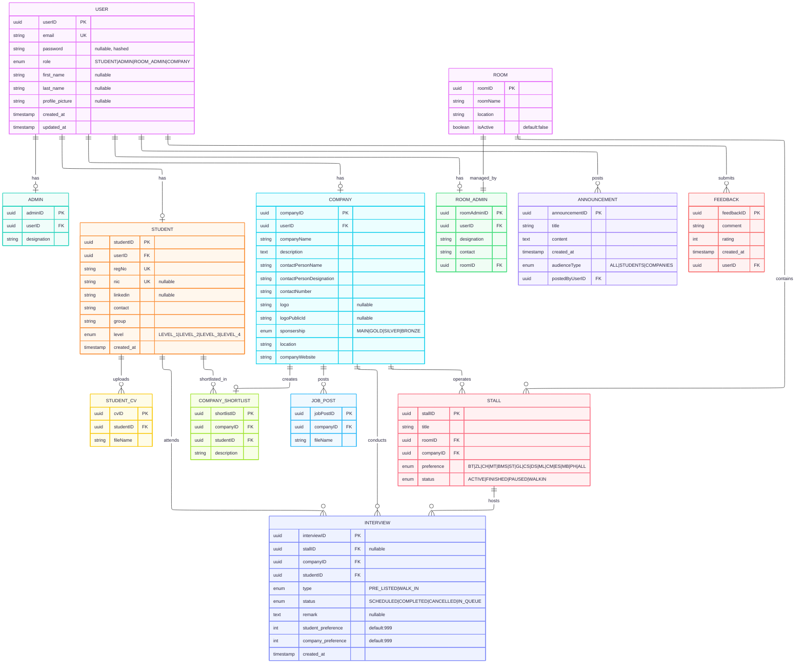

# Project Functionalities

This document outlines the functionalities of the Industry Day 2025 project, covering both the backend API and the frontend web application.

## Project Architecture

This is a **monorepo** built with **Turborepo** containing a full-stack application for managing the Industry Day event at the Faculty of Science, University of Peradeniya. It facilitates interactions between students, companies, administrators, and room administrators for job fairs, interviews, and career opportunities.

## Technologies Used

### Backend (API)

- **Framework**: NestJS 11.x (@nestjs/core)
- **Database**: MySQL with TypeORM (@nestjs/typeorm, mysql2)
- **Authentication**:
  - PassportJS with JWT strategy (@nestjs/passport, passport-jwt)
  - Google OAuth 2.0 (passport-google-oauth20)
  - Local strategy (passport-local)
  - Password hashing with bcrypt
- **File Uploads**:
  - Cloudinary (cloudinary) - for images (logos, profile pictures)
  - Google Drive API (googleapis) - for documents (CVs, job posts)
- **Email**: Resend (via Next.js API route)
- **Security**: express-session, cookie-parser, CORS enabled
- **Validation**: class-validator, class-transformer
- **Testing**: Jest (@nestjs/testing)

### Frontend (Web)

- **Framework**: Next.js 15.x with App Router (next)
- **UI Components**:
  - Radix UI (@radix-ui/react-*)
  - Shadcn UI (custom components)
  - Lucide React (icons)
- **Styling**: Tailwind CSS 4.x (tailwindcss)
- **Form Management**: React Hook Form (@hookform/resolvers)
- **Schema Validation**: Zod (zod)
- **Theme**: next-themes (dark/light mode support)
- **Maps**: React Leaflet (react-leaflet, leaflet)
- **Utilities**: clsx, tailwind-merge, class-variance-authority

### Monorepo Tools

- **Build System**: Turborepo 2.x
- **Package Manager**: npm 11.x
- **Node**: >=18
- **Shared Packages**: UI components, ESLint config, TypeScript config

---

## Backend Functionalities (`/apps/api`)

The backend is a NestJS application that provides a RESTful API to support the frontend application. It is structured into the following modules:

## User Roles & Authentication

### User Roles
The system supports four distinct user roles:
- **STUDENT**: University students looking for jobs/internships
- **COMPANY**: Company representatives managing recruitment
- **ADMIN**: System administrators managing the platform
- **ROOM_ADMIN**: Room administrators managing interview logistics

### Authentication System (`/src/auth`)

- **Description**: Manages user authentication and authorization using multiple strategies.
- **Features**:
  - **Google OAuth 2.0**: Social login integration
  - **Local Authentication**: Email/password login with bcrypt hashing
  - **JWT Tokens**: Cookie-based token storage (httpOnly, secure in production)
  - **Guards**: JwtAuthGuard, GoogleAuthGuard, LocalAuthGuard
- **Endpoints**:
    - `GET /auth/google/login`: Initiates Google OAuth flow
    - `GET /auth/google/redirect`: OAuth callback handler
    - `POST /auth/login`: Authenticates user with email/password
    - `POST /auth/logout`: Logs out user and clears session
- **Entity**: User (userID, email, password, role, first_name, last_name, profile_picture)

---

## Core Modules

### 1. User (`/src/user`)

- **Description**: Base user management for all user types. Serves as the central entity linking all role-specific profiles.
- **Features**:
  - User CRUD operations
  - Profile picture management via Cloudinary
  - Role-based polymorphic relationships
- **Entity**: User (userID, email, password, role, first_name, last_name, profile_picture)
- **Relationships**: OneToOne with Admin, Student, RoomAdmin, Company; OneToMany with Announcements

### 2. Admin (`/src/admin`)

- **Description**: Manages system administrator profiles and functionalities.
- **Features**:
  - Admin designation tracking
  - Platform-wide management capabilities
- **Entity**: Admin (adminID, userID, designation)
- **Endpoints**:
    - `GET /admin`: Retrieves admin-specific data
    - `POST /admin`: Creates new admin resources
    - `PATCH /admin/:id`: Updates admin resources
    - `DELETE /admin/:id`: Deletes admin resources

### 3. Announcement (`/src/announcement`)

- **Description**: Handles event-wide communications and announcements.
- **Features**:
  - Targeted announcements by audience type (ALL, STUDENTS, COMPANIES)
  - Timestamp tracking for chronological display
  - Admin-posted announcements
- **Entity**: Announcement (announcementID, title, content, created_at, audienceType, postedByUserID)
- **Endpoints**:
    - `GET /announcement`: Retrieves all announcements
    - `POST /announcement`: Creates a new announcement
    - `PATCH /announcement/:id`: Updates an announcement
    - `DELETE /announcement/:id`: Deletes an announcement

### 4. Company (`/src/company`)

- **Description**: Manages company profiles and recruitment activities.
- **Features**:
  - Company registration and profile management
  - Sponsorship tier tracking (MAIN, GOLD, SILVER, BRONZE)
  - Logo upload via Cloudinary
  - Contact person details
  - Company location and website
- **Entity**: Company (companyID, companyName, description, contactPersonName, contactPersonDesignation, contactNumber, logo, sponsership, location, companyWebsite)
- **Relationships**: OneToOne with User; OneToMany with CompanyShortlist, Stall, Interview, JobPost
- **Endpoints**:
    - `GET /company`: Retrieves all companies
    - `GET /company/:id`: Retrieves a specific company by ID
    - `POST /company`: Creates a new company profile
    - `PATCH /company/:id`: Updates a company profile

### 5. Student (`/src/student`)

- **Description**: Manages student profiles and academic information.
- **Features**:
  - Student registration and profile management
  - Academic level tracking (Level 1, 2, 3, 4)
  - Registration number and NIC validation
  - LinkedIn profile integration
  - Group/specialization tracking (15 majors: BT, ZL, CH, MT, BMS, ST, GL, CS, DS, ML, CM, ES, MB, PH, ALL)
  - Contact information management
- **Entity**: Student (studentID, regNo, nic, linkedin, contact, group, level)
- **Relationships**: OneToOne with User; OneToMany with StudentCv, Interview, CompanyShortlist
- **Endpoints**:
    - `GET /student`: Retrieves all students
    - `GET /student/:id`: Retrieves a specific student by ID
    - `POST /student`: Creates a new student profile
    - `PATCH /student/:id`: Updates a student profile

### 6. Room Admin (`/src/room-admin`)

- **Description**: Manages room administrators responsible for interview logistics.
- **Features**:
  - Room assignment and management
  - Interview room monitoring
  - Stall supervision
  - Designation and contact tracking
- **Entity**: RoomAdmin (roomAdminID, userID, designation, contact, roomID)
- **Relationships**: OneToOne with User; ManyToOne with Room
- **Endpoints**:
    - `GET /room-admin`: Retrieves room admin data
    - `POST /room-admin`: Creates a new room admin
    - `PATCH /room-admin/:id`: Updates room admin details

---

## Event Management Modules

### 7. Room (`/src/room`)

- **Description**: Manages physical/virtual rooms for interview sessions.
- **Features**:
  - Room creation and activation
  - Location tracking
  - Bulk room creation
  - Active/inactive status management
- **Entity**: Room (roomID, roomName, location, isActive)
- **Relationships**: OneToOne with RoomAdmin; OneToMany with Stall
- **Endpoints**:
    - `GET /room`: Retrieves all rooms
    - `POST /room`: Creates a new room
    - `POST /room/bulk`: Creates multiple rooms
    - `PATCH /room/:id`: Updates room details
    - `DELETE /room/:id`: Deletes a room

### 8. Stall (`/src/stall`)

- **Description**: Manages company booths/stalls at the Industry Day event.
- **Features**:
  - Stall status management (ACTIVE, FINISHED, PAUSED, WALK-IN)
  - Subject preference filtering (15 specializations)
  - Room assignment
  - Company-specific stall configuration
- **Entity**: Stall (stallID, title, roomID, companyID, preference, status)
- **Relationships**: ManyToOne with Room and Company; OneToMany with Interview
- **Subject Preferences**: BT (Biotechnology), ZL (Zoology), CH (Chemistry), MT (Mathematics), BMS (Biomedical Science), ST (Statistics), GL (Geology), CS (Computer Science), DS (Data Science), ML (Machine Learning), CM (Computational Mathematics), ES (Earth Science), MB (Molecular Biology), PH (Physics), ALL
- **Endpoints**:
    - `GET /stall`: Retrieves all stalls
    - `GET /stall/:id`: Retrieves a specific stall
    - `POST /stall`: Creates a new stall
    - `PATCH /stall/:id`: Updates stall details
    - `PATCH /stall/:id/status`: Updates stall status
    - `DELETE /stall/:id`: Deletes a stall

### 9. Interview (`/src/interview`)

- **Description**: Manages interview scheduling, queue management, and interview lifecycle.
- **Features**:
  - **Interview Types**:
    - PRE_LISTED: Company-selected candidates
    - WALK_IN: On-the-spot interviews
  - **Interview Status**: SCHEDULED, IN_QUEUE, COMPLETED, CANCELLED
  - **Priority System**: student_preference (1-5), company_preference (1-5)
  - **Queue Management**: Sophisticated priority-based queuing
  - **Bulk Operations**: Create multiple interviews at once
  - **Next-in-Queue**: Retrieve next candidate for interview
- **Entity**: Interview (interviewID, stallID, companyID, studentID, type, status, remark, student_preference, company_preference)
- **Relationships**: ManyToOne with Stall, Student, Company
- **Unique Constraint**: [companyID, studentID] - prevents duplicate interviews
- **Endpoints**:
    - `GET /interview`: Retrieves all interviews
    - `GET /interview/:id`: Retrieves a specific interview
    - `GET /interview/student/:studentID`: Retrieves student's interviews
    - `GET /interview/company/:companyID`: Retrieves company's interviews
    - `GET /interview/company/:companyID/stall/:stallID`: Retrieves stall-specific interviews
    - `GET /interview/company/:companyID/stall/:stallID/next-walkin`: Gets next walk-in candidate
    - `GET /interview/company/:companyID/stall/:stallID/prelist-queue`: Gets pre-listed queue
    - `GET /interview/company/:companyID/stall/:stallID/walkin-queue`: Gets walk-in queue
    - `POST /interview/prelist`: Creates pre-listed interview
    - `POST /interview/walkin`: Creates walk-in interview
    - `POST /interview/bulk`: Creates multiple interviews
    - `PATCH /interview/:id/schedule`: Schedules an interview
    - `PATCH /interview/:id/complete`: Marks interview as completed
    - `PATCH /interview/:id/cancel`: Cancels an interview
    - `DELETE /interview/:id`: Deletes an interview

---

## Document Management Modules

### 10. CV (`/src/cv`)

- **Description**: Handles student CV/resume management with Google Drive integration.
- **Features**:
  - File upload to Google Drive
  - CV sharing link generation
  - Multiple CVs per student support
  - Automatic cleanup on deletion
  - Drive file ID storage
- **Entity**: StudentCv (cvID, studentID, fileName [stores Google Drive file ID])
- **Service**: GoogleDriveService for file operations
- **Endpoints**:
    - `POST /cv/upload`: Uploads a new CV to Google Drive
    - `GET /cv/:id`: Retrieves CV metadata
    - `GET /cv/student/:studentID`: Retrieves all CVs for a student
    - `GET /cv/:id/share-link`: Generates shareable Google Drive link
    - `DELETE /cv/:id`: Deletes CV from database and Google Drive

### 11. Job Posts (`/src/job-posts`)

- **Description**: Manages job vacancy postings by companies.
- **Features**:
  - Job post file uploads to Google Drive
  - Company-specific job listings
  - File sharing and access management
- **Entity**: JobPost (jobPostID, companyID, fileName [stores Google Drive file ID])
- **Endpoints**:
    - `GET /job-posts`: Retrieves all job posts
    - `GET /job-posts/company/:companyID`: Retrieves company's job posts
    - `POST /job-posts`: Creates a new job post with file upload
    - `DELETE /job-posts/:id`: Deletes a job post

---

## Recruitment Management Modules

### 12. Shortlist (`/src/shortlist`)

- **Description**: Manages company candidate shortlisting and tracking.
- **Features**:
  - Add students to company shortlists
  - Shortlist descriptions/notes
  - View shortlisted candidates
- **Entity**: CompanyShortlist (shortlistID, companyID, studentID, description)
- **Endpoints**:
    - `GET /shortlist`: Retrieves all shortlists
    - `GET /shortlist/company/:companyID`: Retrieves a company's shortlist
    - `POST /shortlist`: Adds a student to a shortlist
    - `DELETE /shortlist/:id`: Removes a student from shortlist

### 13. Feedback (`/src/feedback`)

- **Description**: Manages user feedback collection and analysis.
- **Features**:
  - Rating system (1-5 stars)
  - Comment submission
  - Timestamp tracking
  - User attribution
- **Entity**: Feedback (feedbackID, comment, rating, created_at, userID)
- **Endpoints**:
    - `POST /feedback`: Submits new feedback
    - `GET /feedback`: Retrieves all feedback (admin-only)
    - `GET /feedback/:id`: Retrieves specific feedback

---

## Supporting Services

### 14. Cloudinary Module (`/src/cloudinary`)

- **Description**: Image upload and storage service integration.
- **Usage**:
  - Company logos
  - User profile pictures
- **Features**:
  - Direct upload to Cloudinary CDN
  - Automatic optimization
  - Public URL generation

### 15. Google Drive Module (`/src/google-drive`)

- **Description**: Document storage and management via Google Drive API.
- **Usage**:
  - Student CVs
  - Job post documents
- **Features**:
  - File upload to specific folder
  - File download
  - File deletion
  - Sharing link generation
  - Folder management

---

## Frontend Functionalities (`/apps/web`)

The frontend is a Next.js 15.x application with App Router that provides role-based dashboards and user interfaces. It features responsive design, dark/light mode theming, and interactive components.

---

## Public Routes

### 1. Landing Page (`/page.tsx`)

- **Description**: Main entry point for the application.
- **Features**:
  - Event overview and information
  - Quick access to login/registration
  - Navigation to different sections
- **Components**: Header, navigation elements

### 2. Home Routes (`/home`)

#### 2.1 Home Page (`/home`)
- **Description**: Main home page displaying announcements and event sponsors.
- **Features**:
  - **Announcements Section**: Real-time event announcements
  - **Sponsor Showcase**: Displays sponsors by tier (MAIN, GOLD, SILVER, BRONZE)
  - **Visual Hierarchy**:
    - MAIN sponsors: Full-width display
    - SILVER sponsors: Medium grid (3-column)
    - BRONZE sponsors: Small grid (4-column)
  - Clickable sponsor cards with detailed dialogs
  - Fallback for missing logos
- **Components**: HomeAnnouncement, SponsorDialog, HomeNavbar

#### 2.2 Live Event Page (`/home/live`)
- **Description**: Real-time event status tracking.
- **Features**:
  - Live interview status
  - Current event activities
  - Real-time updates

#### 2.3 Venue Map (`/home/map`)
- **Description**: Interactive venue map using React Leaflet.
- **Features**:
  - Interactive map navigation
  - Room/stall locations
  - Zoom and pan controls
- **Technology**: react-leaflet, leaflet

### 3. Authentication Routes (`/auth`)

#### 3.1 Login Page (`/auth/login`)
- **Description**: User authentication page.
- **Features**:
  - Email/password login form
  - Google OAuth integration
  - Form validation with Zod
  - Remember me option
- **Components**: Login form with React Hook Form

#### 3.2 Student Registration (`/auth/register/student`)
- **Description**: Student account creation.
- **Features**:
  - Multi-step registration form
  - Academic information collection (level, group, registration number)
  - NIC validation
  - LinkedIn profile integration
  - Contact information
- **Validation**: Zod schemas

#### 3.3 Company Registration (`/auth/register/company`)
- **Description**: Company registration request form.
- **Features**:
  - Company information collection
  - Contact person details
  - Email notification to admins (via Resend)
  - Approval-based registration
- **Email API**: `/api/email/company-registration-request`

---

## Protected Dashboard Routes

### 4. Admin Dashboard (`/(dashboards)/admin`)

- **Description**: Comprehensive platform management dashboard for system administrators.
- **Layout Components**: AdminNavbar, AdminSidebar, responsive layout

#### Pages & Functionalities:

##### 4.1 Profile Management (`/admin/profile`)
- Admin profile viewing and editing
- Designation management
- Contact information updates

##### 4.2 Admin Management (`/admin/admins`)
- View all administrators (AdminList component)
- Create new admin accounts (CreateAdmin component)
- Update admin privileges
- Remove admin access

##### 4.3 Student Management (`/admin/students`)
- View all students (StudentList component)
- Create student accounts (CreateStudent component)
- Edit student profiles
- Monitor student activities
- Academic level and group tracking

##### 4.4 Company Management (`/admin/companies`)
- View all companies (CompanyList component)
- Create company accounts (CreateCompany component)
- Update company profiles
- Manage sponsorship tiers
- Approve company registrations

##### 4.5 Room Admin Management (`/admin/room-admins`)
- View room administrators (RoomAdminList component)
- Create room admin accounts (CreateRoomAdmin component)
- Assign rooms to admins
- Update room admin details

##### 4.6 Room Management (`/admin/rooms`)
- View all rooms (RoomList component)
- Create individual or bulk rooms (CreateRoom component)
- Edit room details
- Activate/deactivate rooms
- Track room capacity and assignments

##### 4.7 Stall Management (`/admin/stalls`)
- Assign stalls to companies
- Configure stall preferences (subject specializations)
- Set stall status (ACTIVE, PAUSED, FINISHED, WALK-IN)
- Room-stall assignments

##### 4.8 Interview Management (`/admin/interviews`)
- Overview of all interviews
- Create interviews (CreateInterview component)
- Cancel interviews (CancelInterview component)
- Monitor interview status across all rooms
- Queue management oversight

##### 4.9 Announcements (`/admin/announcements`)
- Create platform-wide announcements
- Target specific audiences (ALL, STUDENTS, COMPANIES)
- Edit/delete announcements
- Timestamp tracking

##### 4.10 Feedback (`/admin/feedback`)
- View all user feedback
- Rating analysis
- Comment review
- User feedback history

##### 4.11 Reports (`/admin/reports`)
- Generate system reports
- User statistics
- Interview analytics
- Event metrics

---

### 5. Company Dashboard (`/(dashboards)/company`)

- **Description**: Recruitment management dashboard for company representatives.
- **Layout Components**: CompanyNavbar, CompanySidebar

#### Pages & Functionalities:

##### 5.1 Profile Management (`/company/profile`)
- Update company information
- Upload/change company logo
- Edit contact person details
- Company description management
- Website and location updates

##### 5.2 Shortlists (`/company/shortlists`)
- View shortlisted candidates
- Add students to shortlist
- Add notes/descriptions for candidates
- Remove from shortlist
- Search and filter shortlisted students

##### 5.3 Pre-listed Interviews (`/company/pre-listed`)
- Manage pre-selected candidates
- Schedule interviews with shortlisted students
- Set priority preferences (1-5)
- Bulk interview creation
- Track pre-listed interview status

##### 5.4 Interview Management (`/company/interviews`)
- View all scheduled interviews
- Update interview status
- Add remarks/notes
- Cancel interviews
- Filter by status (SCHEDULED, IN_QUEUE, COMPLETED, CANCELLED)

##### 5.5 Interview Queue (`/company/interviews/queue`)
- **Real-time queue management**
- View current interview queue
- Next-in-queue display
- Walk-in interview management
- Queue progression controls
- Priority-based ordering
- Separate queues for pre-listed and walk-in

##### 5.6 Job Vacancies (`/company/vacancies`)
- Upload job post documents (PDF, etc.)
- View all posted vacancies
- Delete job posts
- Manage job descriptions
- Files stored in Google Drive

##### 5.7 Announcements (`/company/announcements`)
- View company-targeted announcements
- Platform-wide announcements
- Event updates

##### 5.8 Feedback (`/company/feedback`)
- Submit feedback about the event
- Rate experience (1-5 stars)
- Comment on platform features
- FeedbackForm component

---

### 6. Student Dashboard (`/(dashboards)/student`)

- **Description**: Career opportunities and interview management dashboard for students.
- **Layout Components**: StudentNavbar, StudentSidebar

#### Pages & Functionalities:

##### 6.1 Registration Completion (`/student/register`)
- Complete profile after initial signup
- Add academic details (level, group, registration number)
- NIC verification
- LinkedIn profile linking
- Contact information

##### 6.2 Profile Management (`/student/profile`)
- Update personal information
- Upload CV/resume (multiple CVs supported)
- View/delete uploaded CVs
- Files stored in Google Drive
- Profile picture management

##### 6.3 Interview Schedule (`/student/interviews`)
- View upcoming interviews
- Interview status tracking
- Company details for each interview
- Interview type (pre-listed vs walk-in)
- Room and stall information

##### 6.4 Feedback (`/student/feedback`)
- Submit event feedback
- Rate experience
- Comment on platform
- Provide suggestions

---

### 7. Room Admin Dashboard (`/(dashboards)/room-admin`)

- **Description**: Interview logistics management dashboard for room administrators.
- **Layout Components**: RoomAdminNavbar, RoomAdminSidebar

#### Pages & Functionalities:

##### 7.1 Profile Management (`/room-admin/profile`)
- View/edit profile (AdminProfileCard component)
- Update designation
- Contact information
- Assigned room details

##### 7.2 Stall Management (`/room-admin/stalls`)
- Monitor stalls in assigned room (StallsGroupCard component)
- View stall status
- Track company activities
- Interview progress monitoring
- Real-time stall updates

---

## UI Components Architecture

### Shadcn UI Components (`/components/ui`)
The application uses 30+ pre-built Shadcn UI components:
- **Forms**: button, input, textarea, select, radio-group, form, label
- **Data Display**: card, table, badge, avatar, separator, skeleton
- **Overlays**: dialog, alert-dialog, popover, dropdown-menu, sheet, tooltip
- **Navigation**: navigation-menu, tabs, sidebar, pagination
- **Feedback**: alert, spinner, toast
- **Layout**: scroll-area, collapsible, carousel

### Role-Specific Components

#### Admin Components (`/components/admin`)
- AdminNavbar, AdminSidebar
- AdminList, StudentList, CompanyList, RoomAdminList, RoomList
- CreateAdmin, CreateStudent, CreateCompany, CreateRoomAdmin, CreateRoom
- CreateInterview, CancelInterview
- (14 specialized components)

#### Company Components (`/components/company`)
- CompanyNavbar
- CompanySidebar

#### Student Components (`/components/student`)
- StudentNavbar
- StudentSidebar

#### Room Admin Components (`/components/roomadmin`)
- RoomAdminNavbar
- RoomAdminSidebar
- AdminProfileCard
- StallsGroupCard

### Common Components (`/components/common`)
- DashboardNavbar: Universal dashboard navigation
- Footer: Application footer
- ModeToggle: Dark/light theme switcher (using next-themes)

### Home Components (`/components/home`)
- HomeAnnouncement: Announcement display
- HomeNavbar: Public-facing navigation
- SponsorDialog: Sponsor details modal

### Custom Components (`/components/custom`)
- ErrorNavbar: Error page navigation
- FeedbackForm: Feedback submission form
- NavIcon: Navigation icons
- Announcement: Announcement card
- Header: Page headers

---

## Key Features & Technical Implementation

### 1. Interview Queue System
- **Algorithm**: Priority-based queue management
- **Priority Calculation**: Combines student_preference and company_preference (1-5 scale)
- **Queue Types**:
  - Pre-listed queue: Company-selected candidates
  - Walk-in queue: On-the-spot interview requests
- **Real-time Updates**: Next-in-queue retrieval
- **Status Progression**: IN_QUEUE → SCHEDULED → COMPLETED/CANCELLED

### 2. Sponsorship Tier System
- **Tiers**: MAIN (premium), GOLD, SILVER, BRONZE
- **Visual Hierarchy**:
  - MAIN: Full-width hero display
  - SILVER: Medium grid (3-column responsive)
  - BRONZE: Compact grid (4-column responsive)
- **Interactive**: Click sponsor cards to view detailed information
- **Fallback**: Default images for missing logos

### 3. Subject Specialization Filtering
- **15 Specializations**: BT, ZL, CH, MT, BMS, ST, GL, CS, DS, ML, CM, ES, MB, PH, ALL
- **Stall Preferences**: Companies can filter by student major
- **Student Grouping**: Matches students to relevant companies
- **Dynamic Filtering**: Real-time specialization-based querying

### 4. File Management Strategy
- **Images** (Cloudinary):
  - Company logos
  - User profile pictures
  - CDN delivery
  - Automatic optimization
- **Documents** (Google Drive):
  - Student CVs (PDF, DOCX)
  - Job post files
  - Shareable links
  - Folder organization

### 5. Authentication & Security
- **Multi-Strategy Auth**:
  - Google OAuth 2.0 (social login)
  - Local email/password (bcrypt hashing)
  - JWT tokens (cookie-based, httpOnly)
- **Role-Based Access Control**:
  - Guards on all protected routes
  - Role-specific dashboards
  - Permission-based API endpoints
- **Session Management**:
  - Express sessions
  - Cookie-parser middleware
  - Secure tokens in production

### 6. Theme System
- **Dark/Light Mode**: next-themes integration
- **Persistent**: Theme preference saved
- **System Detection**: Respects OS preferences
- **Seamless Toggle**: ModeToggle component

### 7. Form Validation
- **Backend**: class-validator decorators on DTOs
- **Frontend**: Zod schemas
- **Real-time Validation**: React Hook Form integration
- **Error Messages**: User-friendly feedback
- **Type Safety**: TypeScript throughout

### 8. Email Notifications
- **Service**: Resend API
- **Use Case**: Company registration requests
- **Route**: `/api/email/company-registration-request`
- **Implementation**: Next.js API route
- **Notifications**: Admins notified of new company signups

---

## Database Architecture

### Entity-Relationship Diagram

The complete database schema is visualized in the ER diagram below. The diagram shows all 13 entities, their attributes, and relationships.



**Key Database Design Features:**
- **User-Centric Architecture**: Single USER table with polymorphic relationships to role-specific tables
- **Interview Uniqueness**: Unique constraint on [companyID, studentID] prevents duplicate interviews
- **UUID Primary Keys**: All entities use UUID for distributed system compatibility
- **Enum Types**: Strong typing for roles, statuses, levels, and preferences
- **Nullable Fields**: Flexible schema supporting optional data (logos, profile pictures, remarks)
- **Timestamp Tracking**: Created_at timestamps for audit trails

### Entity Relationships

#### User (Central Entity)
- **OneToOne**: Admin, Student, RoomAdmin, Company
- **OneToMany**: Announcement
- **Purpose**: Centralized authentication and base profile

#### Student
- **OneToOne**: User
- **OneToMany**: StudentCv, Interview, CompanyShortlist
- **Purpose**: Academic and career information

#### Company
- **OneToOne**: User
- **OneToMany**: Stall, Interview, JobPost, CompanyShortlist
- **Purpose**: Recruitment and company details

#### Room
- **OneToOne**: RoomAdmin
- **OneToMany**: Stall
- **Purpose**: Physical/virtual interview spaces

#### Stall
- **ManyToOne**: Room, Company
- **OneToMany**: Interview
- **Purpose**: Company booth at event

#### Interview (Junction Table with Metadata)
- **ManyToOne**: Stall, Student, Company
- **Unique Constraint**: [companyID, studentID]
- **Purpose**: Interview scheduling and queue management

---

## Development Setup Requirements

### Environment Variables

#### Backend (.env in /apps/api)
```
# Database
DB_HOST=localhost
DB_PORT=3306
DB_USERNAME=root
DB_PASSWORD=your_password
DB_DATABASE=industry_day

# Authentication
JWT_SECRET=your_jwt_secret_key

# Cloudinary
CLOUDINARY_CLOUD_NAME=your_cloud_name
CLOUDINARY_API_KEY=your_api_key
CLOUDINARY_API_SECRET=your_api_secret

# Google Drive
GOOGLE_DRIVE_CLIENT_ID=your_client_id
GOOGLE_DRIVE_CLIENT_SECRET=your_client_secret
GOOGLE_DRIVE_REDIRECT_URI=your_redirect_uri
GOOGLE_DRIVE_REFRESH_TOKEN=your_refresh_token
GOOGLE_DRIVE_FOLDER_ID=your_folder_id

# Google OAuth
GOOGLE_CLIENT_ID=your_oauth_client_id
GOOGLE_CLIENT_SECRET=your_oauth_client_secret
GOOGLE_CALLBACK_URL=http://localhost:3000/auth/google/redirect
```

#### Frontend (.env.local in /apps/web)
```
# API URL
NEXT_PUBLIC_API_URL=http://localhost:3001

# Resend (for emails)
RESEND_API_KEY=your_resend_api_key

# Google OAuth (if handled client-side)
NEXT_PUBLIC_GOOGLE_CLIENT_ID=your_client_id
```

### Installation & Setup
```bash
# Install dependencies
npm install

# Run development servers (both apps)
npm run dev

# Run specific app
npm run dev --filter=api
npm run dev --filter=web

# Build all apps
npm run build

# Run tests
npm run test
```

---

## API Documentation Summary

### Authentication Endpoints
- POST `/auth/login` - Login with email/password
- GET `/auth/google/login` - Initiate Google OAuth
- GET `/auth/google/redirect` - OAuth callback
- POST `/auth/logout` - Logout

### User Management
- GET/POST/PATCH/DELETE `/admin`, `/student`, `/company`, `/room-admin`

### Interview System (23+ endpoints)
- POST `/interview/prelist`, `/interview/walkin`, `/interview/bulk`
- GET `/interview/company/:companyID/stall/:stallID/next-walkin`
- PATCH `/interview/:id/schedule`, `/interview/:id/complete`, `/interview/:id/cancel`

### File Management
- POST `/cv/upload`, `/job-posts` (with file upload)
- GET `/cv/:id/share-link`
- DELETE `/cv/:id`, `/job-posts/:id`

### Event Management
- GET/POST/PATCH/DELETE `/room`, `/stall`, `/announcement`
- POST `/room/bulk` (bulk room creation)
- PATCH `/stall/:id/status` (update stall status)

### Recruitment
- GET/POST/DELETE `/shortlist`
- GET `/shortlist/company/:companyID`

### Feedback
- POST/GET `/feedback`

---

## Project Structure

```
Industry-day-2025/
├── apps/
│   ├── api/                    # NestJS Backend
│   │   └── src/
│   │       ├── auth/           # Authentication module
│   │       ├── user/           # User management
│   │       ├── student/        # Student module
│   │       ├── company/        # Company module
│   │       ├── admin/          # Admin module
│   │       ├── room-admin/     # Room admin module
│   │       ├── interview/      # Interview module
│   │       ├── room/           # Room module
│   │       ├── stall/          # Stall module
│   │       ├── cv/             # CV module
│   │       ├── job-posts/      # Job posts module
│   │       ├── shortlist/      # Shortlist module
│   │       ├── announcement/   # Announcement module
│   │       ├── feedback/       # Feedback module
│   │       ├── cloudinary/     # Cloudinary service
│   │       └── google-drive/   # Google Drive service
│   │
│   └── web/                    # Next.js Frontend
│       └── src/
│           ├── app/
│           │   ├── (dashboards)/
│           │   │   ├── admin/      # Admin dashboard
│           │   │   ├── company/    # Company dashboard
│           │   │   ├── student/    # Student dashboard
│           │   │   └── room-admin/ # Room admin dashboard
│           │   ├── auth/           # Authentication pages
│           │   ├── home/           # Public home pages
│           │   └── api/            # API routes (email)
│           │
│           └── components/
│               ├── ui/             # Shadcn components (30+)
│               ├── admin/          # Admin components (14)
│               ├── company/        # Company components
│               ├── student/        # Student components
│               ├── roomadmin/      # Room admin components
│               ├── common/         # Shared components
│               ├── home/           # Home components
│               └── custom/         # Custom components
│
├── packages/
│   ├── ui/                     # Shared UI components
│   ├── eslint-config/          # Shared ESLint config
│   └── typescript-config/      # Shared TS config
│
└── turbo.json                  # Turborepo configuration
```
